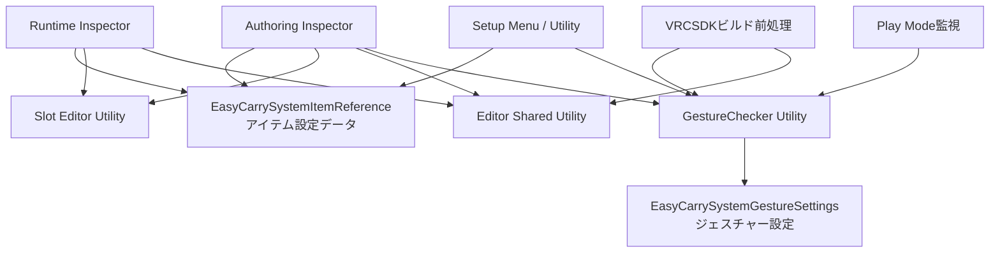

# VRChat向けオブジェクト装備ギミック EasyCarry System

## 導入先

`Assets/Serre/EasyCarrySystem`

## SDKバージョン

基本的にVRCSDK、Modular Avatar共に最新版を使用します。

## パッケージ構成

EasyCarry Systemは、利用者が導入するRuntime部分と、制作者がセットアップに使用するAuthoring部分に分かれています。

ここでいうRuntimeはUnityのPlayer上で動作するランタイムコードではなく、**配布ギミックの利用者向けパッケージ**を指します。各EditorスクリプトはUnity Editor上でのみ動作します。

| 区分 | 含めるフォルダ | 用途 |
| --- | --- | --- |
| Runtime / 共通 | `Runtime`、`Editor`直下 | 配布済みEasyCarry Systemのスロット変更、位置・当たり判定調整、ビルド前検証 |
| Authoring | Runtime / 共通に加えて`Editor/Authoring` | 新規セットアップ、全設定の編集、コピー・ペースト |

Runtime版を作成する場合は、`Editor/Authoring`を含めません。

### Runtimeパッケージの書き出し

Authoring版を導入したUnityプロジェクトで、`Tools/EasyCarry System/Runtimeパッケージを書き出す`を実行します。
選択した親フォルダーに`com.serre.easycarry.runtime`が作成され、EasyCarry System一式から`Editor/Authoring`と`Editor/Authoring.meta`を除いた内容がGUIDを維持したままコピーされます。

GUIDとスクリプトの重複を避けるため、書き出し先には現在のUnityプロジェクト外を指定してください。`package.json`は書き出された`com.serre.easycarry.runtime`の直下に配置します。

## スクリプト構成

### 設定データ

| スクリプト | 役割 |
| --- | --- |
| [`EasyCarrySystemItemReference.cs`](Runtime/EasyCarrySystemItemReference.cs) | 制御対象アイテムに付く設定保持コンポーネントです。生成されたEasyCarry Systemへの参照に加え、スロット番号、各装備位置、Contact、Bone Proxy、メニュー名、オプションなどの設定値を保持します。VRCのEditorOnlyコンポーネントとしてビルド時に除去されます。 |
| [`EasyCarrySystemGestureSettings.cs`](Runtime/EasyCarrySystemGestureSettings.cs) | 左右の握り判定・トリガープル判定に使用するジェスチャー設定を保持します。共有`GestureChecker`に付与され、パラメータ初期値へ反映されます。こちらもビルド時に除去されます。 |

### Runtime / 共通Editor

| スクリプト | 役割 |
| --- | --- |
| [`EasyCarrySystemItemReferenceRuntimeEditor.cs`](Editor/EasyCarrySystemItemReferenceRuntimeEditor.cs) | Runtime版の簡易Inspectorです。アイテムスロット変更、アイテムの当たり判定調整、手持ち位置の位置調整・反転コピー、装備位置リストの位置調整のみを公開します。Authoring版がある場合はAuthoring Inspectorが優先されます。 |
| [`EasyCarrySystemSlotEditorUtility.cs`](Editor/EasyCarrySystemSlotEditorUtility.cs) | スロット選択UIと`EasyCarrySystem_00`～`EasyCarrySystem_15`のPrefab Variant交換を担当します。Item Referenceの保存値を新しいVariantへ適用し、対象アイテム上のConstraintを新しい`CI_Root`へ接続し直します。 |
| [`EasyCarrySystemAssetLocator.cs`](Editor/EasyCarrySystemAssetLocator.cs) | `EasyCarrySystemRootMarker.txt`のGUIDからEasyCarry Systemの配置先を解決します。`Assets`・`Packages`のどちらに配置しても、各アセットをルートからの相対パスで読み込めます。 |
| [`EasyCarrySystemEditorSharedUtility.cs`](Editor/EasyCarrySystemEditorSharedUtility.cs) | セクション表示、階層検索、VRC Parent Constraint・Contact参照、装備位置リスト、ウェイト切り替え、Inspectorロック、ビルド前設定などの共通処理をまとめています。 |
| [`EasyCarrySystemGestureCheckerEditorUtility.cs`](Editor/EasyCarrySystemGestureCheckerEditorUtility.cs) | アバター内の共有`GestureChecker`を検索・生成し、ジェスチャー設定をModular Avatar Parametersの初期値へ反映します。複数生成や参照不整合の検証も担当します。 |
| [`EasyCarrySystemGestureCheckerLifecycle.cs`](Editor/EasyCarrySystemGestureCheckerLifecycle.cs) | Play Mode開始時に`GestureChecker`が不足していないか確認します。不足時は確認ダイアログを表示し、生成するかPlay Modeを中止します。 |
| [`EasyCarrySystemGestureCheckerBuildRequest.cs`](Editor/EasyCarrySystemGestureCheckerBuildRequest.cs) | VRCSDKのビルド開始要求を受け、編集シーン上で不足している`GestureChecker`を確認・生成してからビルドを続行します。 |
| [`EasyCarrySystemAvatarBuildProcessor.cs`](Editor/EasyCarrySystemAvatarBuildProcessor.cs) | VRCSDKのアバタービルド前処理です。保存設定の適用、`GestureChecker`の存在確認、対象アイテム内の不正なMA Bone Proxyと追従用Constraintの検証、装備位置設定のAP_00への正規化、Editor用コンポーネントの除去を行います。問題がある場合はビルドを停止します。 |

### Authoring専用Editor

| スクリプト | 役割 |
| --- | --- |
| [`EasyCarrySystemSetupMenu.cs`](Editor/Authoring/EasyCarrySystemSetupMenu.cs) | Hierarchyの右クリックメニューに`EasyCarry System/Setup`を追加し、選択オブジェクトのセットアップを開始します。 |
| [`EasyCarrySystemSetupEditorUtility.cs`](Editor/Authoring/EasyCarrySystemSetupEditorUtility.cs) | 未使用スロットの選択、Prefab Variantの生成、対象アイテムへのItem ReferenceとVRC Constraintの追加、共有`GestureChecker`の用意を行います。生成EasyCarry Systemが削除された場合は、Inspectorの生成ボタンから同じ処理を再実行します。 |
| [`EasyCarrySystemItemReferenceAuthoringEditor.cs`](Editor/Authoring/EasyCarrySystemItemReferenceAuthoringEditor.cs) | Authoring版のフルInspectorです。位置・Contact・接続方法・ジェスチャー・装備時オプション・メニュー表示名・装備位置リストの追加、削除、並び替えを編集します。Scene上の調整用ハンドルとInspectorロックも管理します。 |
| [`EasyCarrySystemComponentClipboardEditorUtility.cs`](Editor/Authoring/EasyCarrySystemComponentClipboardEditorUtility.cs) | `EasyCarrySystemItemReference`のコンテキストメニューへ設定値のCopy/Pasteを追加します。貼り付け先のスロット番号を維持したまま、位置やContactなどのAuthoring設定を複製します。 |
| [`EasyCarrySystemGestureSettingsAuthoringEditor.cs`](Editor/Authoring/EasyCarrySystemGestureSettingsAuthoringEditor.cs) | `GestureChecker`単体を選択した場合のジェスチャー設定Inspectorを提供し、設定変更をパラメータ初期値へ反映します。 |
| [`EasyCarrySystemRuntimePackageExporter.cs`](Editor/Authoring/EasyCarrySystemRuntimePackageExporter.cs) | Runtime配布用フォルダーを書き出します。Authoring専用ファイルを除外し、必須ファイルと除外結果を検証します。 |

## 主な処理の関係

## 主な処理フロー

### 新規セットアップ

1. Hierarchyで装備させたいオブジェクトを右クリックし、`EasyCarry System/Setup`を実行します。
2. `EasyCarrySystemSetupEditorUtility`が未使用スロットのPrefab Variantを生成します。
3. 対象オブジェクトに`EasyCarrySystemItemReference`とVRC Parent / Scale Constraintを追加し、生成したEasyCarry Systemの`CI_Root`へ接続します。対象オブジェクトは元の階層に残ります。
4. アバター内に共有`GestureChecker`がなければ生成します。

### スロット変更

1. `EasyCarrySystemSlotEditorUtility`が現在の位置、Contact、装備位置、オプション、メニュー名をItem Referenceへ保存します。
2. 選択した番号のPrefab Variantへ交換します。
3. Item Referenceの保存値を新しいPrefabへ適用し、対象アイテムのConstraintを新しい`CI_Root`へ接続します。

### Play Mode・ビルド開始

1. Play Mode開始時は`EasyCarrySystemGestureCheckerLifecycle`、ビルド開始時は`EasyCarrySystemGestureCheckerBuildRequest`が共有`GestureChecker`を確認します。
2. 不足している場合は生成確認を表示し、ビルド時は編集シーン上へ生成してから処理を続行します。
3. `EasyCarrySystemAvatarBuildProcessor`がビルド用アバター上で`GestureChecker`を再検証します。Play Mode開始時は全アイテムの装備位置をAP_00へ戻し、ビルド時もAP_00へ正規化してMA Bone Proxyや追従用Constraintの構成を検証します。
4. `EasyCarrySystemItemReference`と`EasyCarrySystemGestureSettings`をビルド対象から除去します。

## 運用ルール

- EasyCarry Systemを移動・パッケージ化する場合は、`EasyCarrySystemRootMarker.txt`とその`.meta`を必ず一緒に含めてください。
- `master`基準で動作確認を行うため、基本的にはpullだけで問題ありません。
- 動作確認が必要な場合はserreから連絡します。
- Prefabに更新が入る場合があるため、機能確認用の変更はPrefab Variantで行ってください。
- 問題や改善点はIssueで管理し、担当者にserreを設定してください。
- 機能追加を分担する場合はブランチを作成し、Pull Requestを送ってください。
